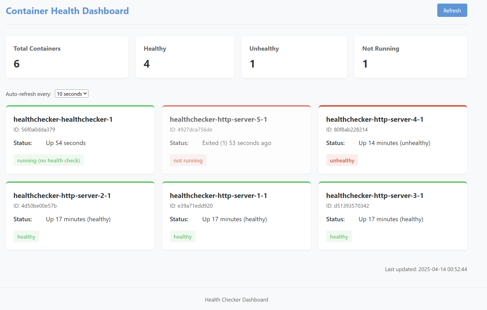

# Docker Container Health Checker

A ~~robust~~ monitoring tool for Docker containers that provides real-time health status visualization through a beautiful web dashboard.



## Objectives

This project aims to:

1. **Monitor Docker containers** in real-time through the Docker API
2. **Visualize container health** with an intuitive, user-friendly dashboard
3. **Track health status** of multiple containers, including those with and without built-in health checks
4. **Provide both visual and API access** to container health data

## Features

- **Beautiful Web Dashboard**
  - Real-time container status visualization
  - Color-coded container cards (green for healthy, red for unhealthy)
  - Status summary with counts of healthy/unhealthy containers
  - Auto-refresh functionality with configurable intervals
  - Mobile-friendly responsive design

- **Comprehensive Health Monitoring**
  - Detects container running status
  - Interprets Docker health check results
  - Provides status for containers without health checks
  - Displays container IDs and status information

- **Flexible Access**
  - HTML dashboard for visual monitoring
  - JSON API for programmatic access (`/health?format=json`)
  - Auto-refresh and manual refresh options

## Technology Stack

- **Backend**: Go (Golang)
- **Frontend**: HTML5, CSS3, JavaScript
- **Containerization**: Docker
- **API**: Docker Engine API
- **Orchestration**: Docker Compose

## Prerequisites

- Docker installed on your host system
- Docker Compose (included with Docker Desktop)

## How to Run

### Using Docker Compose (Recommended)

1. Clone this repository:
   ```bash
   git clone git@github.com:diego-augusto/cchecker.git
   cd cchecker
   ```

2. Build and run the containers:
   ```bash
   docker-compose up --build
   ```

3. Access the dashboard in your browser:
   ```
   http://localhost:8080
   ```

### Accessing the Dashboard

- **Web Dashboard**: `http://localhost:8080` or `http://localhost:8080/health`
- **JSON API**: `http://localhost:8080/health?format=json`

## How It Works

1. The health checker connects to the Docker API through the Docker socket
2. It queries all containers on the system, including their health status
3. Container health data is processed and categorized
4. The data is visualized through an HTML dashboard or made available via JSON API
5. Auto-refresh functionality keeps the dashboard updated at configurable intervals

## Customization

- Change the refresh rate through the dashboard dropdown
- Modify the `PORT` environment variable in docker-compose.yml to use a different port
- Extend the container to monitor specific containers or services

## License

[MIT License](LICENSE)

## Contributing

Contributions are welcome! Please feel free to submit a Pull Request. 
